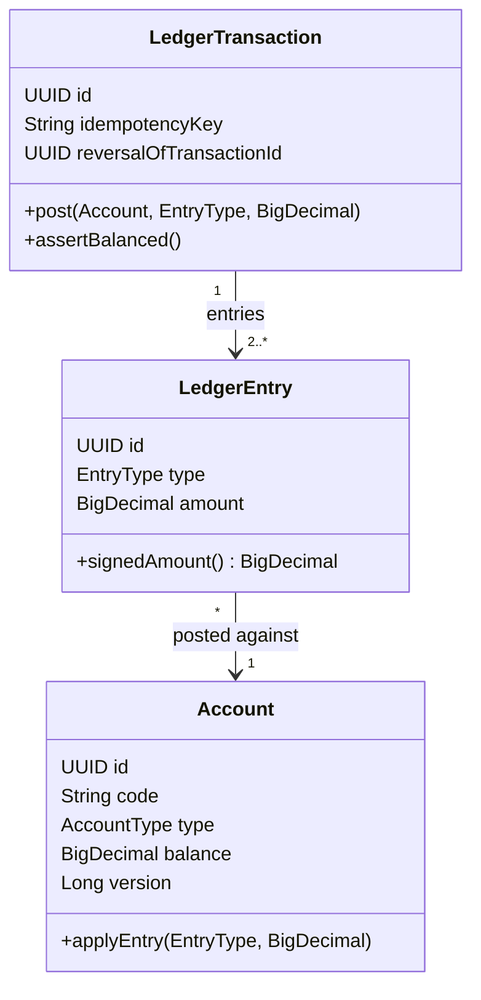

# ledger

A double-entry bookkeeping ledger service in Java 21 + Spring Boot 3. The
point of this project isn't another CRUD API - it's demonstrating that a
financial ledger's hard parts are domain invariants and concurrency
correctness, not endpoints: every transaction must balance to zero, history
is append-only, an account can never go negative, and a burst of parallel
transfers against the same account must still land on the exact right
balance without losing or duplicating a single entry.

```bash
docker compose up --build
```

| Service | URL |
| --- | --- |
| API | http://localhost:8080 |
| Swagger UI | http://localhost:8080/swagger-ui.html |
| OpenAPI JSON | http://localhost:8080/v3/api-docs |

## Why double-entry bookkeeping

A single-entry "balance" column you increment and decrement is easy to get
wrong under concurrency and impossible to audit after the fact - if a
number looks wrong, there's no way to reconstruct *why*. Double-entry
fixes both problems structurally: every economic event is recorded as at
least two entries whose signed amounts sum to exactly zero (money doesn't
appear or disappear, it only moves between accounts), and the full history
of entries is the source of truth that account balances are derived from,
not the other way around. That's the actual point of this project - the
domain model *enforces* that invariant rather than trusting callers to
maintain it.

## Domain model



- **`Account.balance` is a materialized snapshot, not the source of
  truth.** It's recomputed transactionally on every posted entry so reads
  don't require scanning history, but `ReportService.statement()`
  independently recomputes a period's balances straight from
  `LedgerEntry` rows (see the account-statement report below) - the two
  are cross-checked implicitly by every integration test that calls both
  `GET /accounts/{id}` and the statement endpoint and asserts they agree.
- **Every `AccountType` has a normal balance side**, exactly as in real
  bookkeeping: assets and expenses grow on the debit side, liabilities/
  equity/income grow on the credit side (`AccountType.normalBalanceSide()`).
  The "an account may never go negative" invariant is enforced on that
  side uniformly - e.g. a revenue account can't be debited past what it
  has accrued in credits. This was caught by a unit test during
  development: an earlier version applied "debit always increases" to
  every account type, which made crediting a fresh revenue account (a
  perfectly normal thing to do) look like an illegal overdraft.
- **The ledger is append-only by construction, not convention.**
  `LedgerTransactionRepository` and `LedgerEntryRepository` deliberately
  extend Spring Data's bare `Repository` marker interface instead of
  `JpaRepository`/`CrudRepository` - there is no `delete` method to call
  by accident. A correction is a new transaction that reverses the
  original entry-for-entry (`LedgerTransaction.reversalOf`, unit-tested);
  it isn't exposed as its own REST endpoint here, since it would need to
  duplicate transfer's exact optimistic-locking-retry-plus-idempotency
  machinery, and that machinery deserved one thoroughly tested
  implementation rather than two similar ones.
- **Amounts are `BigDecimal`, scale 4, `RoundingMode.HALF_UP`** applied at
  the API boundary (`TransferController`, `AccountController`) - never
  `double`, anywhere.

## Concurrency: why optimistic locking, not pessimistic

`Account.version` (`@Version`) is the concurrency-control mechanism for
`TransferService`. The reasoning, and why it isn't `SELECT ... FOR UPDATE`:

- Accounts are read far more often than written, and write contention on
  any single account is expected to be occasional, not sustained - this
  models a ledger, not one hot shared counter. Optimistic locking costs
  nothing on the read path and nothing on an uncontended write.
- Pessimistic locking would take a row lock on *every* transfer whether or
  not there's an actual conflict, and would require lock-ordering
  discipline (always lock the two accounts in a fixed order, e.g. by id)
  to avoid deadlocking two transfers moving money in opposite directions
  between the same pair of accounts. With optimistic locking there's no
  such ordering requirement: both accounts are read independently, and
  only a genuine concurrent write causes a conflict.
- The cost of a conflict is paid only when a conflict actually happens -
  as a retry, not as a lock held by every request up front.

`TransferService.transfer` re-reads both accounts fresh on every retry
attempt (`TransferAttemptExecutor.attempt`, its own `@Transactional`
method so the retry loop actually sees a new transaction per attempt, not
a stale in-memory snapshot from a failed one). That's what makes the retry
loop correct rather than just "try the same thing again": a retry either
observes the effect of the transfer it just lost the race with (and may
then legitimately fail with insufficient funds) or observes room to
succeed. `AccountRepository.findByIdForUpdate` (`PESSIMISTIC_WRITE`) is
kept in the codebase purely as a pessimistic-locking comparison point; it
isn't used on the transfer path.

## Idempotency

`POST /transfers` requires an `Idempotency-Key` header. The guarantee
("a repeated request must not post the transfer twice") is enforced at
two layers, not one:

1. **Fast path**: `LedgerTransaction.idempotencyKey` is looked up first;
   if a transaction with that key already exists, its result is returned
   immediately without touching the transfer logic at all.
2. **The actual guarantee**: `idempotency_key` is a database `UNIQUE`
   constraint. If two requests with the same key both pass the fast-path
   check (a genuine race - both arrive before either has committed), only
   one `INSERT` can win; the loser gets a `DataIntegrityViolationException`
   at commit, which `TransferService` catches and turns into a replayed
   result by looking the winner's transaction back up. The database
   constraint is what's actually load-bearing here; the in-memory check is
   only a fast path that lets non-racing duplicates skip a wasted attempt.

`TransferIdempotencyIT` tests both cases: a sequential duplicate request
(fast path) and ten genuinely concurrent requests sharing one
`Idempotency-Key` (the constraint-race path) - both assert exactly one
transaction is created and the money moves exactly once.

## Security

Stateless JWT (HS256, via `jjwt`) - `JwtAuthFilter` builds the
`Authentication` directly from the token's claims (subject + role), with
**no per-request database lookup**. That's what makes this genuinely
stateless rather than "stateless in name, session-lookup in practice" -
the trade-off, documented here rather than hidden, is that revoking a
single compromised token before it expires would need an explicit
deny-list, which isn't implemented.

## Reports

- `GET /reports/accounts/{id}/statement?from=&to=` - an opening balance
  (the signed sum of everything before `from`, computed by the database
  via a JPQL aggregate query, not by pulling full history into the JVM)
  followed by a running balance for every entry in the period.
- `GET /reports/turnover?from=&to=` - total debits/credits per
  `AccountType`, aggregated in one `GROUP BY` query
  (`LedgerEntryRepository.aggregateByAccountType`) against an
  interface-based Spring Data projection (`TurnoverRow`).

## API surface

| Method | Path | Notes |
| --- | --- | --- |
| POST | `/auth/register` | Public. Returns a JWT. |
| POST | `/auth/login` | Public. Returns a JWT. |
| POST | `/accounts` | Opens an account; rejects a duplicate `code` with 409. |
| GET | `/accounts` | Lists accounts. |
| GET | `/accounts/{id}` | Account detail including its live balance snapshot. |
| GET | `/accounts/{id}/balance` | Balance only. |
| POST | `/transfers` | Requires `Idempotency-Key`. 201 on first success, 200 on an idempotent replay, 409 on insufficient funds or exhausted concurrency retries. |
| GET | `/reports/accounts/{id}/statement` | Opening/closing balance + per-entry running balance for a period. |
| GET | `/reports/turnover` | Per-category debit/credit totals for a period. |

Full request/response schemas are in Swagger UI once the app is running.

## Testing

```bash
mvn test      # unit tests: JUnit 5 + Mockito, no Docker required
mvn verify    # + Testcontainers integration tests against real Postgres
```

- **Unit tests** (`AccountTest`, `LedgerTransactionTest`,
  `TransferServiceTest`, `ReportServiceTest`): the zero-sum and
  never-negative domain invariants directly, and `TransferService`'s
  retry/idempotency logic with `TransferAttemptExecutor` mocked to throw
  `ObjectOptimisticLockingFailureException` / `DataIntegrityViolationException`
  on demand - so the retry loop's behavior is verified deterministically,
  without needing an actual race to happen.
- **Integration tests** (`*IT`, Testcontainers Postgres, real HTTP via
  `TestRestTemplate`, real Flyway migrations, no mocks):
  - `TransferConcurrencyIT` - the core resilience test. N parallel
    transfers against the same source account: one run with exactly
    enough funds for all of them (asserts every request succeeds, the
    final balance is exact, and no entry is lost - `2N` entries, checked
    via the statement report), one run with funds for only half (asserts
    the success count is exact, the rest fail with 409, and the balance
    never goes negative).
  - `TransferIdempotencyIT` - sequential and genuinely concurrent
    duplicate requests sharing one `Idempotency-Key`.
  - `LedgerApiIT` - broader smoke coverage: auth, duplicate-account-code
    rejection, a real transfer plus both report endpoints, missing-header
    rejection.

## Running it

```bash
docker compose up --build
```

Starts Postgres and the app (Flyway migrates on startup) with no API keys
or external services required.

```bash
curl -s -X POST localhost:8080/auth/register \
  -H 'Content-Type: application/json' \
  -d '{"username":"demo","password":"password123"}'
# -> { "token": "...", "expiresAt": "..." }

TOKEN=<paste token>

curl -s -X POST localhost:8080/accounts -H "Authorization: Bearer $TOKEN" \
  -H 'Content-Type: application/json' \
  -d '{"code":"CASH","name":"Cash","type":"ASSET","currency":"USD","openingBalance":100.00}'

curl -s -X POST localhost:8080/transfers -H "Authorization: Bearer $TOKEN" \
  -H 'Content-Type: application/json' -H 'Idempotency-Key: demo-key-1' \
  -d '{"fromAccountId":"...","toAccountId":"...","amount":10.00,"description":"demo"}'
```

## What I'd change for a real deployment

- Token revocation: an explicit deny-list (checked by `JwtAuthFilter`)
  for compromised tokens, at the cost of the per-request lookup this
  design deliberately avoids.
- A `POST /transactions/{id}/reverse` endpoint reusing `TransferService`'s
  retry/idempotency pattern (see "domain model" above for why it isn't
  here yet).
- Multi-currency transfers with an exchange-rate service, instead of the
  current same-currency assumption.
- Pagination on the statement endpoint - it currently returns the full
  entry list for the requested period.
